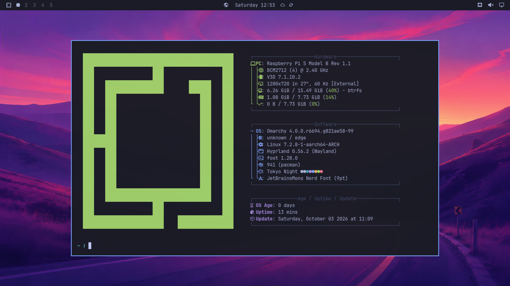
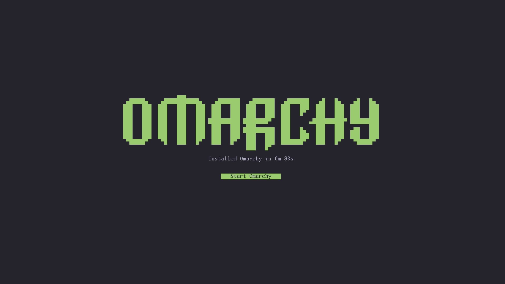

# Omarchy Pi

[](https://github.com/tcballard/omarchy-badges)

Builds an Omarchy disk image for the Raspberry Pi from Arch Linux ARM's rpi-aarch64 root, using the Raspberry Pi platform support on the [`raspberry-pi-platform`](https://github.com/linyiru/omarchy/pull/1) branch of Omarchy.

Status: a prototype. The image builds under emulation on an x86_64 host and boots on a Raspberry Pi 5 (16 GB) through first-boot setup to the Omarchy desktop, with all 16 GB and the Pi's V3D GPU.



## Build

On Arch Linux, with `sudo`, `qemu-user-static` and `qemu-user-static-binfmt` (x86_64 hosts only), `systemd-nspawn`, `btrfs-progs`, `dosfstools`, `rsync`, `libarchive` and `base-devel`:

```bash
bin/build-image ~/Projects/omarchy ~/Projects/omarchy-pkgs omarchy-pi.img
```

The first argument is an Omarchy checkout with Raspberry Pi support, the second an [omarchy-pkgs](https://github.com/omacom/omarchy-pkgs) checkout for the `omarchy-dev` and `omarchy-settings-dev` PKGBUILDs. Downloads go to `~/.cache/omarchy-pi` (`OMARCHY_PI_CACHE`). Write the result to an SD card or USB drive with `dd` or Raspberry Pi Imager's custom image option.

## Run it on a Raspberry Pi 5

Tested on a Raspberry Pi 5 (16 GB) from a microSD card, with HDMI and wired Ethernet.

1. Write the image to the card. Check the device name with `lsblk` first; this overwrites it:

   ```bash
   sudo dd if=omarchy-pi.img of=/dev/sdX bs=4M conv=fsync status=progress
   ```

2. Boot the Pi from the card with a screen and a keyboard attached. The first boot sets up the hardware, rebuilds the initramfs and asks for the owner (keyboard layout, user name, password, hostname, timezone) on tty1, then logs that user in to the Omarchy desktop. The desktop renders on the Pi's V3D GPU.

### How long it takes

The Pi needs about 47 seconds of its own time, firmware not counted, to go from a freshly written card to the Omarchy desktop. Measured on a Raspberry Pi 5 (16 GB) from a microSD card with wired Ethernet on 2026-10-03, from the journal of that boot, in seconds since the kernel started:

| step | from | to | took |
|---|---|---|---|
| kernel, initramfs and systemd up to first-boot setup | 0.0 | 6.5 | 6.5 s |
| first-boot hardware setup (pacman keyring 12.6 s, initramfs rebuild 4.0 s) | 6.5 | 26.6 | 20.1 s |
| owner setup on tty1 | 26.6 | 241.5 | waiting for input |
| owner setup finishing (user, theme, Node.js) | 241.5 | 257.2 | 15.7 s |
| graphical session up to Hyprland running | 257.2 | 262.3 | 5.1 s |

That comes to 47.4 s outside of owner setup. The firmware stage before the kernel isn't in the journal and isn't counted. This is the baseline for later work; the pacman keyring is the largest single step.

A second fresh card the same day, booting with the quiet console, took 38 seconds: 22 s from the kernel to the owner setup screen and 16 s finishing setup after the owner confirmed, shown here by a demo build's install finish screen (the released image goes straight to the desktop). [docs/install-finish-screen.md](docs/install-finish-screen.md) covers what the number counts and how the demo build works:



What to know:

- SSH is installed but its port is closed; open it with `sudo ufw allow 22/tcp`.
- The root partition stays at the image's size; it is not grown to fill the card.

## What the image is

- **Disk:** an MBR with a 512 MiB FAT32 boot partition and a btrfs root holding `@`, `@home`, `@log` and `@pkg`, as an Omarchy ISO install lays them out, plus a read-only `@factory` snapshot for factory reset (`bin/disk`).
- **Boot:** the way Raspberry Pi OS boots: the Pi's firmware reads `config.txt`, picks the board's device tree and overlays, and loads Raspberry Pi's kernel (Arch Linux ARM's `linux-rpi`, as `kernel8.img`) and the initramfs, with the kernel command line from `cmdline.txt`. Arch Linux ARM's root comes with the mainline `linux-aarch64` and U-Boot instead; the build replaces both. Only the root on the command line changes, to the btrfs root by UUID and its `@` subvolume.
- **System:** the Pi's default package set from `omarchy-pkg-defaults raspberrypi`, set up by `omarchy-apply-system --defer-provisioning --first-install` as the ISO does, with hardware setup deferred to the Pi's first boot (`/var/lib/omarchy/image/target` says `platform=raspberrypi`).
- **First boot:** makes the machine's own pacman keyring, runs the deferred hardware setup, rebuilds the initramfs for the board, then asks for the owner on tty1. Owner setup unpacks the Node.js tarball the image carries, so none of it needs the network. The image ships no account: Arch Linux ARM's `alarm` user is removed and root is locked until owner setup.

## Layout

- `bin/build-image` - the whole build
- `bin/build-packages` - builds the Omarchy packages and `packages/` for aarch64 on the host
- `bin/disk` - creates, mounts and snapshots the disk image
- `stages/` - run inside the image root, in order: repositories, Omarchy, boot, finalization
- `packages/omarchy-rpi-boot` - a prototype of the boot package `omarchy-lifecycle-dispatch` expects on a Pi; unencrypted roots only

## Emulation workarounds

Under qemu-user some things the build needs don't work. Each is confined to the build and to the step that needs it:

- pacman runs with `--disable-sandbox` (no Landlock).
- snapper can't create `/.snapshots` (no btrfs ioctls), so `bin/disk` creates it from the host.
- iptables can't reach nftables (no netfilter netlink), so ufw's version check is answered while it writes its rules files.
- mkinitcpio's autodetect would read the build host, so the image's initramfs is built without it, and the first boot rebuilds it on the Pi.
